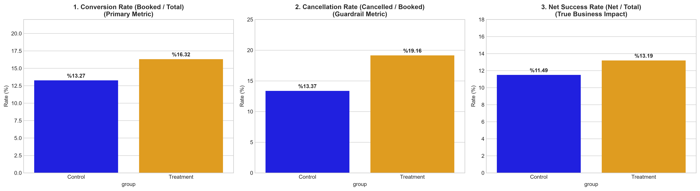

# 🏨 Hotel Booking A/B Testing: Urgency Message & Cancellation Analysis

## 📌 Executive Summary
This project is an end-to-end A/B testing analysis designed to evaluate the impact of an in-app urgency message (**"Limited 4-Star Suites Available! Final 2 Hours!"**) on a mobile hotel booking platform.

Most simple A/B tests only look at initial conversion rates. However, urgency nudges often cause impulse buying, which can lead to higher cancellation rates later. This project measures both the **primary metric (Conversion Rate)** and the **guardrail metric (Cancellation Rate)** to determine the **real business impact (Net Successful Bookings)** using statistical testing.

---

## 📊 Key Metrics & Hypothesis Test Results

The experiment ran for 31 days with **30,000 unique users** split evenly (15,000 Control, 15,000 Treatment).

| Metric | Control Group | Treatment Group | Absolute Difference | Test Statistic (Z) | p-value | 95% Confidence Interval | Result |
| :--- | :---: | :---: | :---: | :---: | :---: | :---: | :---: |
| **Conversion Rate (Booked / Total)** | 13.27% | 16.32% | **+3.05%** | $Z = 7.45$ | $p < 0.001$ | $[+2.25\%, +3.86\%]$ | **Statistically Significant Increase** |
| **Cancellation Rate (Cancelled / Booked)** | 13.37% | 19.16% | **+5.79%** | $Z = 5.16$ | $p < 0.001$ | $[+3.63\%, +7.95\%]$ | **Statistically Significant Increase (Risk)** |
| **Net Success Rate (Net Bookings / Total)** | 11.49% | 13.19% | **+1.70%** | $Z = 4.48$ | $p < 0.001$ | $[+0.96\%, +2.44\%]$ | **Statistically Significant Net Gain** |

---

## 🔍 Visual Summary

---

## 💡 Key Findings & Business Recommendations

1. **The Trade-off:** The urgency banner successfully motivated users to complete their bookings (+3.05% lift in conversion). However, it also increased customer regret: cancellations among booked users rose significantly from 13.37% to 19.16%.
2. **The Net Impact:** Despite the higher cancellation rate, the initial booking volume was large enough to offset the cancellations. Overall, net successful bookings increased by **+1.70%** ($p = 7.61 \times 10^{-6}$), meaning the company still made a net financial gain.
3. **Business Recommendation (Roll-out Decision):**
   * **Recommendation:** **Launch the feature (Roll-out approved).**
   * **Operational Note:** Operations and support teams should be prepared for a ~5.8% rise in cancellation inquiries. Product teams could also test soft retention nudges on the cancellation screen to reduce lost bookings.

---

## 🛠️ Statistical Methodology

* **Data Integrity & SRM Check:** Conducted a Chi-Square ($\chi^2$) Goodness-of-Fit test to check for Sample Ratio Mismatch (SRM). The split was verified as 50/50 without any traffic bias ($p = 1.000$).
* **Hypothesis Testing:** Applied two-proportion Z-tests (`proportions_ztest`) and computed 95% Wald Confidence Intervals for the differences in proportions.
* **Temporal Stability (Novelty Effect):** Tracked 31-day cumulative net conversion rates to verify that the positive effect was stable over time and not just a short-lived novelty bias.

---

## 📁 Project Structure

├── data/
│   └── raw/                      # Raw dataset (hotel_booking_ab_testing.csv)
├── notebooks/
│   └── 01_eda_and_cleaning.ipynb # Full analysis, cleaning, and hypothesis tests
├── reports_tradeoff_metrics.png   # Bar chart showing conversion, cancellation, and net rate
├── reports_novelty_trend.png      # Time-series cumulative trend chart
└── README.md                     # Project documentation

---

## 💻 Tech Stack & Libraries
* **Python 3.x**
* **Pandas & NumPy:** Data wrangling and metric aggregation
* **SciPy & Statsmodels:** Statistical hypothesis testing, SRM checks, and confidence intervals
* **Matplotlib & Seaborn:** Data visualization
